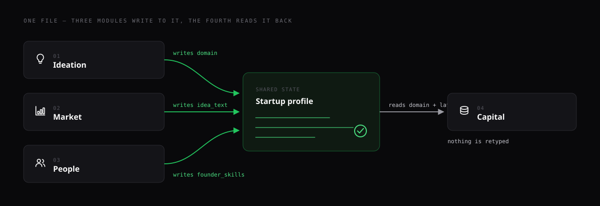
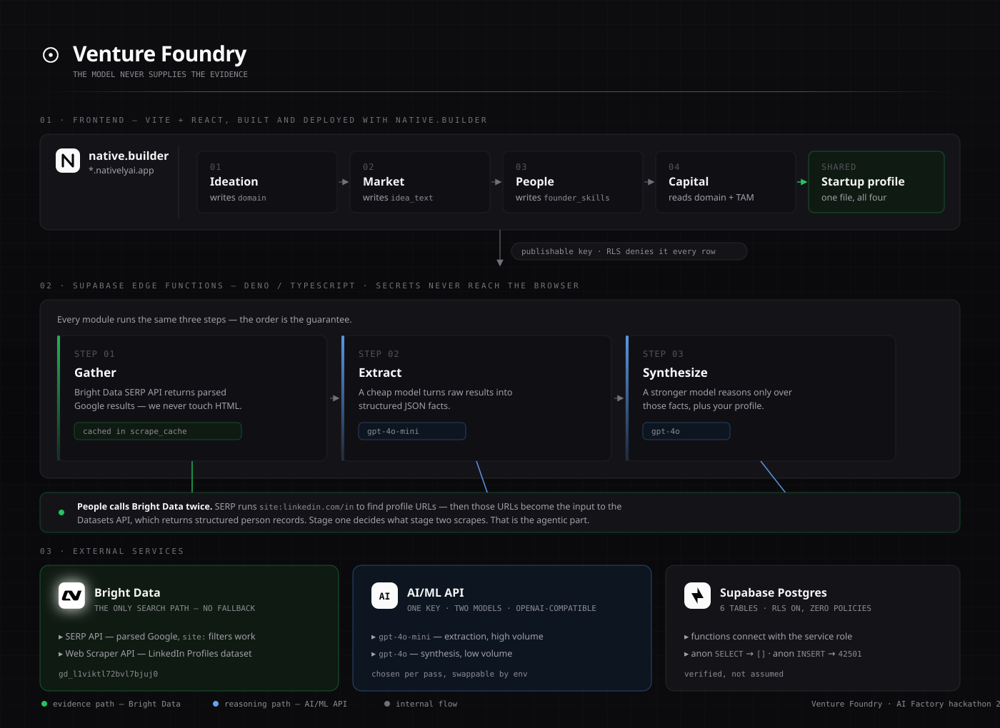
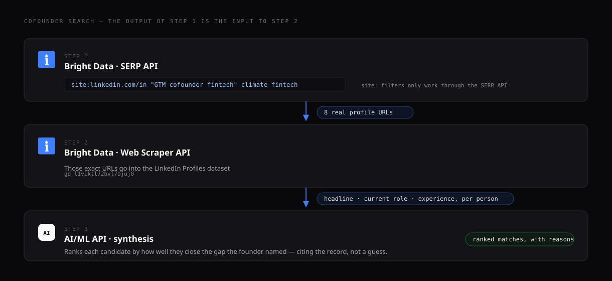

<p align="center">
  
</p>

<p align="center">
  <em>Research your idea before you build it. Every result carries the link it came from.</em>
</p>

<p align="center">
  <a href="#the-problem">Problem</a> ·
  <a href="#the-solution">Solution</a> ·
  <a href="#architecture">Architecture</a> ·
  <a href="#how-we-use-bright-data">Bright Data</a> ·
  <a href="#how-we-use-aiml-api">AI/ML API</a> ·
  <a href="#setup">Setup</a>
</p>

---

## The problem

A founder validating an idea has to answer four questions before anyone will
take them seriously:

1. Is this a real problem, or does it just feel like one?
2. How big is the market, and how do you know?
3. Who covers the skills I don't have?
4. Which investors actually fund this, and what do I say to them?

Today that means a fortnight of browser tabs — or twenty minutes with a chatbot
that answers confidently from training data. **The second is worse**, because the
output looks like research. Ask an LLM for the TAM of carbon-accounting software
and you get a number with no provenance: no source, no method, no date. It might
be right. You cannot tell, and neither can the investor you repeat it to.

## The solution

**Venture Foundry never lets the model supply the evidence.**

Every answer starts with a live web search. The results are turned into
structured facts by one model, and only then does a second, stronger model
reason over those facts. The model's job is to interpret evidence it was handed
— never to recall it.

The result: a market size that arrives with the ten pages it was derived from, a
cofounder candidate with a LinkedIn URL you can open, an investor with an
opening line quoting something they actually published.

Four modules write into **one shared startup profile**, so each one starts where
the last finished:

<p align="center">
  
</p>

Capital is locked in the UI until a domain exists, because that dependency is
real rather than decorative.

## How we solve it

Every module runs the same three steps:

| Step | What happens | Cost profile |
|---|---|---|
| **Gather** | Bright Data SERP API returns parsed Google results, cached in `scrape_cache` by query hash | one search, cached forever |
| **Extract** | `gpt-4o-mini` turns raw results into structured JSON facts | cheap, high volume |
| **Synthesize** | `gpt-4o` reasons over those facts plus the profile, and writes the result | expensive, low volume |

Splitting the cheap and expensive passes is the point: the small model reads
everything, the large model reads only what survived.

## Architecture

<p align="center">
  
</p>

The browser holds only the Supabase URL and publishable key. **RLS is enabled on
all six tables with zero policies**, so that key can read nothing — verified:
anon `SELECT` returns `[]`, anon `INSERT` returns `42501`. Every read and write
goes through an Edge Function using the service role, which is also where the
Bright Data and AI/ML keys live. Nothing secret is ever compiled into the bundle.

## How we use Bright Data

Bright Data is the **only** search path. There is no fallback scraper — a module
that cannot gather evidence raises `503`/`502` rather than quietly answering
with nothing behind it.

**SERP API** — parsed Google results via `brd_json=1`, so we never parse HTML.
It also makes `site:` filters usable, which matters more than it sounds.

**Web Scraper API** — the LinkedIn Profiles dataset (`gd_l1viktl72bvl7bjuj0`).

### The two-stage flow that makes cofounder search work

This module returned **zero results** for the entire life of the project until
Bright Data was wired in, and the reason is instructive: a plain web search
returns *articles about cofounder matching*. It cannot return people.

<p align="center">
  
</p>

Stage one's output is stage two's input — the search decides what gets scraped.
That is the agentic part, and it is the difference between "no candidates found"
and a named person with a working profile link.

Bounded on purpose: URLs deduped and capped at 8, dataset polling budgeted at
90s, everything cached by query. A dataset job that outruns its budget degrades
to the SERP results instead of failing the request.

## The competitor map — where the model does real work

Market draws your competitors on a picture, with your idea placed among them.
The interesting part isn't the dots. **Nothing in the research names the two
axes** — the model has to read every competitor description and work out which
two questions actually separate that market.

They come out completely different each time. Both of these are real output:

```
"A carbon-accounting API for mid-size logistics companies"
  →  Solution Integration   standalone software ── API integration
     Industry Focus         general enterprise ── logistics-specific

"A command-line tool that finds slow Postgres queries"
  →  Ease of Use            manual setup ── user-friendly interface
     Database Focus         general-purpose ── specialised tuning
```

Four questions, no overlap. A carbon market splits on integration and vertical;
a developer tool splits on setup effort and scope. There are thousands of
markets, each with its own pair — so there is no table to look them up in. That
is what makes this a model's job rather than a lookup.

Your idea is scored on the same two questions, quoting something it actually
says, and the emptiest quadrant is marked. The empty corner is presented as a
question, not an opportunity — it may be empty because nothing works there.

Three parts of that are the model (derive the axes, place the competitors with a
reason each, place your idea). The empty quadrant is arithmetic and the drawing
is ordinary code.

## How we use AI/ML API

One key, two models, chosen per pass:

```ts
chat(messages, { reasoning: false })  // gpt-4o-mini — extraction
chat(messages, { reasoning: true })   // gpt-4o      — synthesis
```

Both configurable by env (`AIML_FAST_MODEL`, `AIML_REASONING_MODEL`), so model
choice is a deployment decision, not a code change.

One hard-won detail lives in `_shared/pipeline.ts`: the fast model wraps its JSON
in ` ```json ` fences often enough that a bare `JSON.parse` throws most
extractions away — and the synthesis pass then reasons over
`{raw: "```json..."}` instead of facts. That single bug produced **0 investor
leads and 0 citations**. `parseJson` strips fences before parsing, in both
passes.

## Tech stack

| Layer | Choice |
|---|---|
| Frontend | Vite + React 19 + TypeScript, Tailwind v4 |
| Built & deployed with | **native.builder** — Vite/React app published to `*.nativelyai.app` |
| Backend | Supabase Edge Functions (Deno + TypeScript) |
| Database | Supabase Postgres — 6 tables, RLS, `updated_at` trigger |
| Search & scraping | Bright Data — SERP API + Web Scraper API |
| Models | AI/ML API — `gpt-4o-mini`, `gpt-4o` |
| 3D | three.js (landing hero), lazy-loaded so app pages don't pay for it |

## What's novel here

**Provenance is the product.** Most "AI research assistants" produce prose you
have to trust. Every result here shows where it came from — `Sourced via Bright
Data · Google SERP`, with clickable citations on each claim. You can check the
work before you rely on it.

**The model never supplies the evidence.** Gather → extract → synthesize is a
structural guarantee, not a prompt instruction. The synthesis model only ever
sees facts extracted from a real search.

**Search output feeds the scraper.** Cofounder search chains two Bright Data
products, using the first's results to decide the second's inputs.

**One file, four modules.** State accumulates rather than resetting. By the time
you reach Capital it already knows your domain and your market size.

## Setup

### 1. Database

Supabase → **SQL Editor** → paste [`supabase/schema.sql`](nativebuilder/supabase/schema.sql) → Run.

Creates 6 tables, indexes, an `updated_at` trigger, and enables RLS with no
policies — anon is denied outright.

### 2. Edge Function secrets

Template: [`supabase/functions/.env.example`](nativebuilder/supabase/functions/.env.example)

```bash
supabase secrets set --env-file supabase/functions/.env
```

| File | Goes where | Reaches the browser? |
|---|---|---|
| [`.env.example`](nativebuilder/.env.example) | frontend env | Yes — compiled into the bundle |
| [`supabase/functions/.env.example`](nativebuilder/supabase/functions/.env.example) | Edge Function secrets | No — server-side only |

Never move `AIML_API_KEY` or `BRIGHTDATA_API_TOKEN` into the frontend file.

**Bright Data needs a zone.** Create one at
[brightdata.com/cp/zones](https://brightdata.com/cp/zones) and set
`BRIGHTDATA_SERP_ZONE` to its name — a token alone is not enough, and requests
fail with `zone_not_found`.

### 3. Deploy the functions

```bash
supabase functions deploy profile idea market cofounder investor
```

`_shared/` is not a function — the leading underscore keeps Supabase from
deploying it as one.

### 4. Frontend

```bash
npm install
npm run dev      # http://localhost:3000
npm run build
```

## Endpoints

| Endpoint | Body | Returns |
|---|---|---|
| `POST /functions/v1/profile` | `{owner_id}` | profile |
| `GET /functions/v1/profile/:id` | — | profile |
| `GET /functions/v1/profile/:id/full` | — | profile + all saved results |
| `PATCH /functions/v1/profile/:id` | partial profile | profile |
| `POST /functions/v1/idea` | `{profile_id, domain, interests}` | `{idea_cards, sourced_via}` |
| `POST /functions/v1/market` | `{profile_id, idea_text}` | `{market_report, sourced_via}` — the report carries `positioning` |
| `POST /functions/v1/cofounder` | `{profile_id, founder_profile, desired_complement}` | `{matches, sourced_via, profiles_enriched}` |
| `POST /functions/v1/investor` | `{profile_id}` | `{leads, sourced_via}` |

Errors come back as `{ "detail": "..." }`.

## Known limits

- **No auth.** One profile per browser via `localStorage`. Fine for a demo, not
  for real users — the next step is Supabase Auth with policies scoped by
  `auth.uid()`.
- **Cofounder yield varies.** Google surfaces the profiles it surfaces; some
  searches enrich eight and produce one strong match.
- **No streaming.** Bright Data returns one response per request, so search
  cannot stream. The AI/ML calls could, and that's the natural next improvement.
